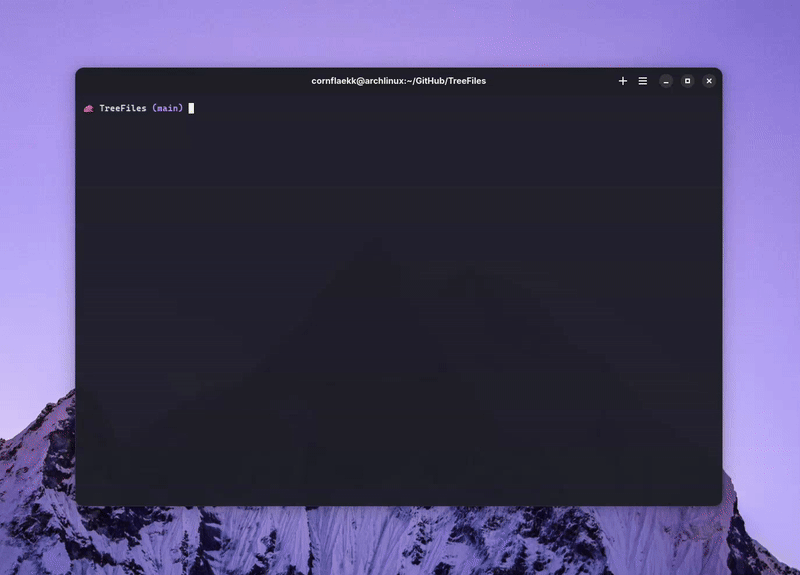

# TreeFiles



TreeFiles is a CLI tool for easy directory space allocation visualization.

The same C++17 sources support native Windows and Linux. Windows uses PDCurses
and the system's default file associations; Linux uses ncurses and `xdg-open`.

## Download and run

The [GitHub releases page](https://github.com/CornFlaekk/TreeFiles/releases) hosts
Windows x64 and Linux x64 packages for each published version. Download the
package for your platform and its `.sha256` file. Packages include the executable,
this guide, the demonstration and third-party notices.

On Windows, extract `treefiles-windows-x64.zip` and run from PowerShell:

~~~powershell
Get-FileHash .\treefiles-windows-x64.zip -Algorithm SHA256
Expand-Archive .\treefiles-windows-x64.zip -DestinationPath .\TreeFiles
.\TreeFiles\treefiles.exe "$env:USERPROFILE\Documents"
~~~

Compare the SHA-256 result with `treefiles-windows-x64.zip.sha256`. The executable
requires no compiler, WSL or extra runtime DLLs. Add its directory to your own
PATH if you want to run `treefiles.exe` from any folder.

On Debian/Ubuntu, install the runtime libraries, verify the archive and extract it:

~~~bash
sudo apt-get install libncursesw6 libstdc++6 xdg-utils
sha256sum --check treefiles-linux-x64.tar.gz.sha256
mkdir -p TreeFiles
tar -xzf treefiles-linux-x64.tar.gz -C TreeFiles
./TreeFiles/treefiles ~/Documents
~~~

The Linux package requires glibc 2.35 or newer. For an older distribution or
another architecture, build from source using the instructions below.

## Windows development (PowerShell)

Clone the repository and run:

```powershell
cd TreeFiles
.\scripts\build_windows.ps1 -Test
.\build\windows-debug\treefiles.exe .
```

The first build downloads a pinned, SHA-256-verified [w64devkit](https://github.com/skeeto/w64devkit)
toolchain into `.tools/` and PDCurses 3.9 into the CMake build directory. It
requires internet access. Later builds reuse these downloads. No administrator
access or global PATH changes are required. WSL and the old MinGW compiler are
not needed. Use a PowerShell terminal in Windows Terminal or VS Code.

If Windows PowerShell blocks local scripts, allow them for the current session:

```powershell
Set-ExecutionPolicy -Scope Process -ExecutionPolicy Bypass
```

To use the compiler, CMake and GDB directly in the current PowerShell session:

```powershell
.\scripts\setup_windows.ps1
cmake --build build/windows-debug
ctest --test-dir build/windows-debug --output-on-failure
gdb .\build\windows-debug\treefiles.exe
```

For a release build and a distributable ZIP:

```powershell
.\scripts\build_windows.ps1 -Configuration Release -Test
.\scripts\package_windows.ps1
```

The Windows executable statically links PDCurses and the C++ runtime. Users can
extract the ZIP and run `treefiles.exe` without installing the development tools.

## Linux development

On Debian/Ubuntu:

```bash
sudo apt-get update
sudo apt-get install -y g++ cmake ninja-build libncurses-dev xdg-utils
cmake -S . -B build/linux-debug -G Ninja -DCMAKE_BUILD_TYPE=Debug
cmake --build build/linux-debug --parallel
ctest --test-dir build/linux-debug --output-on-failure
./build/linux-debug/treefiles .
```

The existing `make`, `make test` and `make install` commands also remain supported.
The Makefile is for Linux; use CMake or the PowerShell scripts on Windows.

## Usage

~~~text
treefiles [--headless] [--page-size N] [--lang en|es] [--save-settings] [directory]
~~~

| Option | Behavior |
|--------|----------|
| `directory` | Directory to inspect; defaults to the current directory |
| `--page-size N` / `--page-size=N` | Files and directories per page, default 30 before saved settings |
| `--lang en` / `--lang es` | Interface language; English is the default |
| `--save-settings` | Save the effective language and page size for future runs |
| `--headless` | Read events from stdin and print structured frames |
| `--help`, `-h` | Show command-line help |
| `--version` | Show the application version |

Pass a directory as the optional argument; the default is the current directory.
Quote paths containing spaces. Use the arrows to select, `E` to expand/collapse,
`N`/`P` for pagination, Space to open, Delete to delete after confirmation,
`B` to change colors, and `Q` to quit.

```powershell
.\build\windows-debug\treefiles.exe "$env:USERPROFILE\Documents"
'DOWN', 'e', 'q' | .\build\windows-debug\treefiles.exe --headless .
```

Headless mode logs opening actions without launching external applications.
Confirmed deletion still removes the selected file or directory.

Use `--page-size N` (or `--page-size=N`) to configure the number of files and
directories per page. The default is 30 unless a saved page size is present;
`N` must be a positive integer up to
2147483647. The limit applies independently to every directory, including
expanded subdirectories. Previous/next navigation rows do not count toward it.
This option works in both interactive and headless mode. Use `--help` for usage.

Settings are loaded from the same `config.ini` as bar colors. Defaults are
English and 30 entries per page. A valid config value overrides the default;
`--lang` and `--page-size` override config for the current session. They are
saved only when you pass `--save-settings`, for example:

~~~powershell
.\build\windows-debug\treefiles.exe --lang es --page-size 10 --save-settings .
~~~

Changing bar colors keeps the saved language and page size. Existing config
files with only foreground/background continue to work.

```powershell
.\build\windows-debug\treefiles.exe --page-size 10 .
'n', 'p', 'q' | .\build\windows-debug\treefiles.exe --headless --page-size 10 .
```

```bash
./build/linux-debug/treefiles --page-size 10 .
```

Entries are sorted by size, largest first, and then by name. Expanding a folder
shows its children in the tree. The size bar is relative to the entries displayed
at that level. Pagination and scrolling are independent: a large page can still
be scrolled to fit the terminal.

Displayed sizes are logical file lengths in bytes, including sparse files; they
do not estimate how many storage blocks a file occupies. Files larger than 1 TiB
are included in directory totals.

### Keyboard shortcuts

| Key | Action |
|-----|--------|
| Up / `k` | Move up |
| Down / `j` | Move down |
| Right / `l` | Expand a directory; advance a selected next-page row |
| Left / `h` | Fold a directory; from a child, select and fold its parent |
| Enter | Enter the selected directory; activates a selected page row |
| Backspace | Return to the parent directory |
| `O` | Type a path relative to the current root or an absolute path |
| `g` / `G` | Select the first / last row of the current tree |
| `E` | Toggle directory expansion or activate a pagination row |
| `N` / `P` | Next / previous page of the selected directory |
| `R` | Re-scan the current root and update cached sizes |
| Space | Open with the system's default application |
| Delete | Delete the selected file or directory after confirmation |
| `B` | Choose the bar's background and text colors |
| `W` | Review filesystem errors and omitted entries from the last scan |
| `Q` | Quit |

TreeFiles lists symbolic links and Windows directory junctions without following
them. A link can be opened with Space or deleted without deleting its target.
If an item could not be read, directory sizes are marked partial or unavailable;
press `W` to review the affected paths and filesystem errors.

In the color picker, use arrows or `j/k`, Enter to confirm each color and Escape
to cancel. The picker starts with the current colors. In delete confirmations,
use left/right or `h/l` to select, Enter to confirm, or `y/n` to answer directly.

### Language

English is the default. Select Spanish for a session with:

~~~powershell
.\build\windows-debug\treefiles.exe --lang es --page-size 10 .
~~~

`--lang=es` also works. The language covers the footer, page labels, prompts,
color picker, loading indicator and command-line help. Headless protocol keys
such as `selected_index` remain stable; the `language` field identifies the
selected language. Unsupported language codes exit with code 2.

### Saved colors

Confirm both colors with `B` to save them automatically for the next session.
Canceling the picker keeps the current configuration. Settings are per user:

| Platform | Configuration file |
|----------|--------------------|
| Windows | `%LOCALAPPDATA%\TreeFiles\config.ini` |
| Linux | `$XDG_CONFIG_HOME/treefiles/config.ini`, or `~/.config/treefiles/config.ini` |

The file uses canonical English color names:

~~~ini
foreground=black
background=yellow
~~~

Supported names are `black`, `red`, `green`, `yellow`, `blue`, `magenta`, `cyan`
and `white`. Missing or invalid fields use their defaults. Remove the file to
reset the colors. Saving uses a temporary file and replaces the old file only
after the write succeeds; a failed save reports an error.

Set `TREEFILES_CONFIG` to a different file for portable use or isolated tests:

~~~powershell
$env:TREEFILES_CONFIG = "$PWD\colors.ini"
.\build\windows-debug\treefiles.exe .
~~~

### Headless use and tests

Pipe one event per line. Arrow events use `UP`, `DOWN`, `LEFT` and `RIGHT`;
`SPACE`, `DELETE`, `ENTER`, `BACKSPACE` and `REFRESH` represent those actions.
`CD <path>` changes to a path relative to the current root or to an absolute
path; the entire remainder of the line is treated as the literal path. Letter shortcuts work as
in the interactive interface. `COLOR foreground background` applies and saves
colors; `B` only logs the available choices in headless mode.

~~~powershell
'COLOR white blue', 'j', 'l', 'q' |
    .\build\windows-debug\treefiles.exe --headless --page-size 10 .
~~~

Frames contain the current path, language, page size, pagination, selection,
scrolling, expansion, colors, entry list, `scan_status`, and structured
`diagnostics_count`/`diagnostic_N` records. Headless opening logs an action;
confirmed deletion still removes files. Exit codes are 0 on success, 1 when the
root cannot be listed, and 2 for invalid command-line options. Errors isolated
to a child keep accessible results and mark the scan partial.

## Troubleshooting

- If Windows blocks local scripts, use the process-scoped execution policy
  shown above. Run the build from PowerShell in Windows Terminal or VS Code.
- If the first Windows build cannot download dependencies, check internet
  access and rerun it. Downloads are checksum-verified and cached in `.tools/`.
- If a Linux package reports a missing ncurses library, install `libncursesw6`.
  A glibc version error requires building from source on your distribution.
- If file opening fails on Linux, install `xdg-utils` and run within a desktop
  session. Windows uses the registered file association.
- If colors cannot be saved, check that the configuration directory is writable
  or set `TREEFILES_CONFIG` to a writable file.

## Releases

GitHub Actions builds and tests Windows x64 and Linux x64 on pushes and pull
requests. Publishing a GitHub release triggers builds of that release's tag.
After **both** platforms pass, the workflow attaches:

- `treefiles-windows-x64.zip`
- `treefiles-linux-x64.tar.gz`
- A SHA-256 checksum file for each package.

The workflow must be present in the release's tagged commit. A failed build
prevents the upload job; rerun the failed workflow after resolving the problem.

For the first version, prepare a draft release named `v0.1.0` targeting `main`.
Merge the feature PR and wait for both platform checks before publishing the
draft. Publishing triggers the release workflow, which verifies the package
checksums and attaches both platforms. Downloadable archives are also available
as workflow artifacts before publication.
The Linux package is built on Ubuntu 22.04 and needs glibc 2.35 or newer and
the ncurses wide-character and C++ runtimes (`libncursesw6` and `libstdc++6`
on Ubuntu 22.04 or newer).
Both platforms include third-party notices in `licenses/`.
